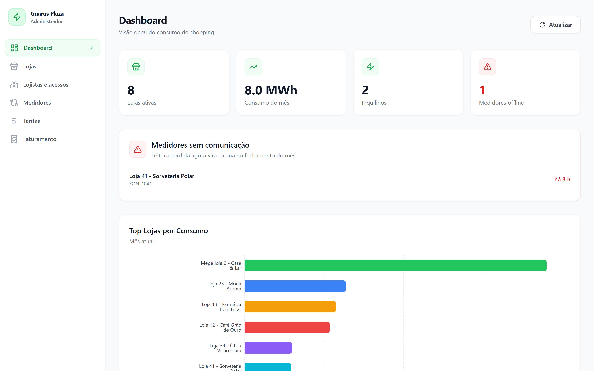
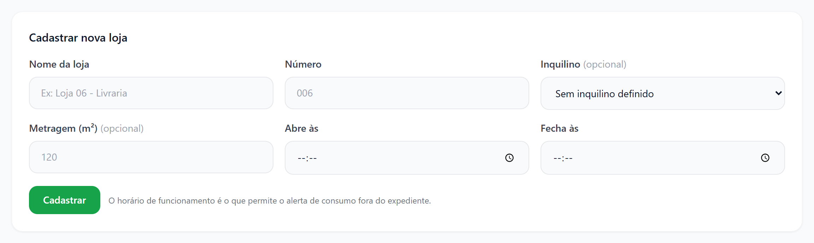
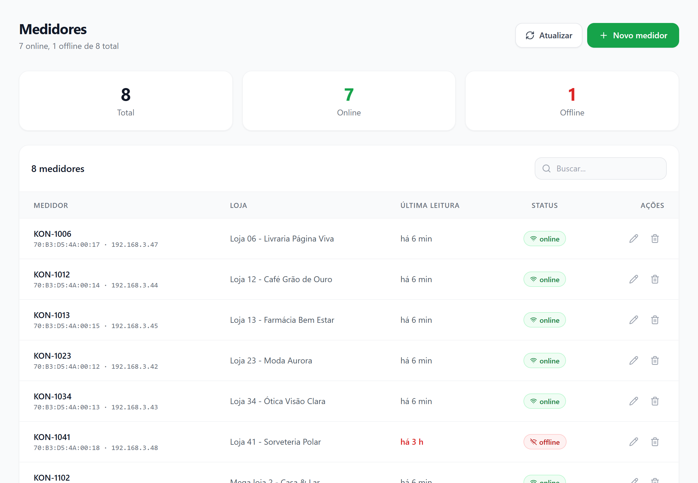
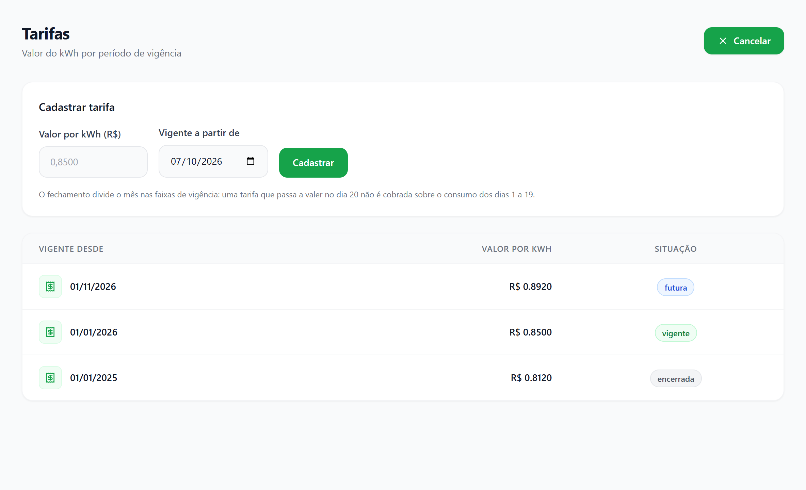
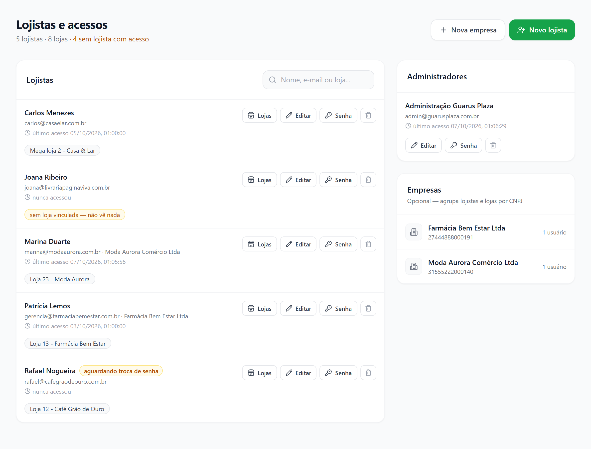
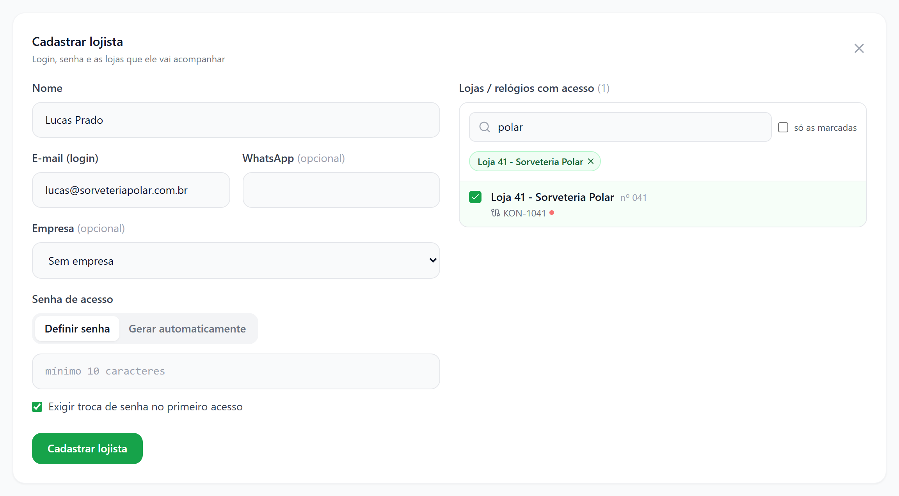
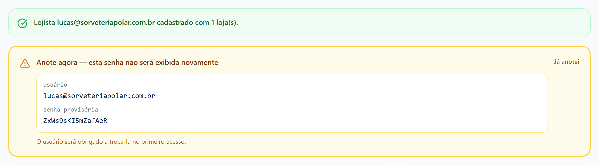
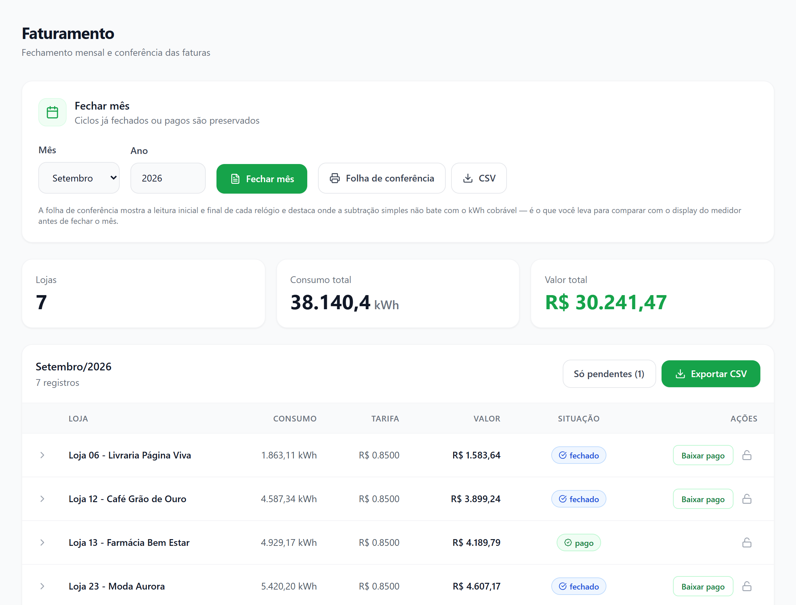
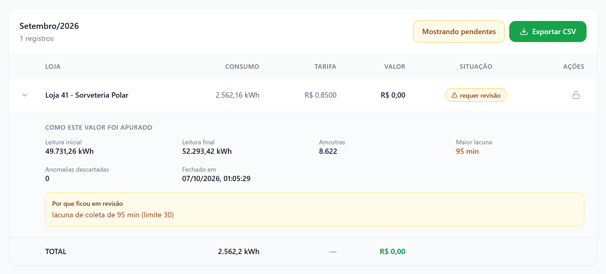

# Manual do Administrador — Guarus Plaza Energia

> Para a administração do shopping: quem cadastra lojas, relógios, tarifas e lojistas, e fecha o faturamento do mês.
> Leia antes o [Manual do Lojista](lojista.md) — ele explica as telas que o lojista vê e as palavras usadas aqui.
> Atualizado em 07/10/2026.

---

## 1. Antes de tudo: como o sistema funciona

Cada loja tem um ou mais relógios Kron ligados à rede do shopping. Um computador no próprio shopping lê os relógios a
cada 30 segundos, e o sistema na internet busca essas leituras a cada 10 segundos. Com as leituras, a tarifa e o
cadastro, o sistema apura o consumo de cada loja e, no fim do mês, emite a fatura.

<!-- fluxo-admin -->

| Quem | Vê | Faz |
|---|---|---|
| **Administrador** | Todas as lojas, todos os relógios, todo o faturamento | Cadastra, fecha o mês, registra pagamento, cria acessos |
| **Lojista** | Só as lojas vinculadas ao acesso dele | Acompanha consumo, faturas e alertas da própria loja |

---

## 2. Primeira configuração (faça nesta ordem)

| # | Onde | O quê | Por quê |
|---|---|---|---|
| 1 | **Trocar senha** (menu lateral) | Trocar a senha do administrador | A senha inicial é conhecida por quem instalou o sistema |
| 2 | **Tarifas** | Cadastrar o valor do kWh vigente | Sem tarifa, nenhuma fatura é emitida: o mês inteiro fica "requer revisão" |
| 3 | **Lojas** | Conferir nome, número e **horário de funcionamento** de cada loja | O horário é o que faz funcionar o alerta de desperdício fora do expediente |
| 4 | **Medidores** | Conferir se cada relógio está vinculado à loja certa | Relógio sem loja não entra no faturamento |
| 5 | **Lojistas e acessos** | Criar o acesso de cada lojista e marcar as lojas dele | Sem loja marcada, o lojista entra e não vê nada |
| 6 | **Dashboard** | Ver se há "Medidores sem comunicação" | Leitura perdida vira lacuna no fechamento |
| 7 | **Faturamento** | No fim do primeiro mês, gerar a **Folha de conferência** e bater com o display dos relógios | É a prova de que o número do sistema é o número do relógio |

---

## 3. Dashboard — o shopping de relance

**Dashboard**, no menu, abre "Visão geral do consumo do shopping":

| Cartão | O que mostra |
|---|---|
| **Lojas ativas** | Lojas cadastradas e não removidas |
| **Consumo do mês** | Soma de todas as lojas desde o dia 1º (em kWh ou MWh) |
| **Inquilinos** | Empresas cadastradas em **Lojistas e acessos** |
| **Medidores offline** | Relógios sem comunicação há mais de 10 minutos. Fica vermelho quando é maior que zero |

- **Medidores sem comunicação** aparece logo abaixo quando algum relógio parou, com a loja, o número de série e desde
  quando ("há 3 h"). Leitura perdida agora vira lacuna no fechamento do mês — vale agir no mesmo dia.
- **Top Lojas por Consumo** é o ranking do mês atual.
- **Atualizar** recarrega os números.

---

## 4. Lojas

### 4.1 Cadastrar uma loja

1. Em **Lojas**, clique em **Nova loja**.
2. Preencha **Nome da loja** (ex.: "Loja 06 - Livraria") e **Número** (ex.: "006").
3. Opcional: **Inquilino**, **Metragem (m²)**, **Abre às** e **Fecha às**.
4. Clique em **Cadastrar**.
5. Deve aparecer "Loja "Loja 06 - Livraria" cadastrada." e a loja na lista.

> Preencha **Abre às** e **Fecha às**. Sem horário, o alerta "Desperdício fora do horário" que o lojista criar nunca
> dispara — e ele não tem como saber disso pela tela dele.

### 4.2 Editar e remover

- O lápis da linha abre o mesmo formulário com os dados da loja; termine em **Salvar alterações**.
- A lixeira remove a loja. O histórico de leituras e faturas é preservado — a loja deixa de aparecer nas listagens e
  no fechamento.

O que pode aparecer:

| Mensagem | O que fazer |
|---|---|
| "Loja tem 2 medidor(es) vinculado(s). Desvincule antes de remover." | Em **Medidores**, edite cada relógio da loja e escolha "Sem loja vinculada" (ou outra loja). Depois remova |
| "Dados inválidos — ..." | O texto depois do traço diz qual campo. Metragem aceita só número |

---

## 5. Medidores (relógios)

"Medidores" mostra quantos estão online e offline, e uma linha por relógio com número de série, MAC, IP, loja, última
leitura e situação.

| Situação | O que quer dizer |
|---|---|
| **online** | Mandou leitura nos últimos 10 minutos |
| **offline** | Está sem comunicação há mais de 10 minutos. A coluna "Última leitura" diz desde quando, em vermelho |

### 5.1 Cadastrar ou trocar um relógio de loja

1. Em **Medidores**, clique em **Novo medidor** (ou no lápis de um existente).
2. Preencha **MAC** (ex.: `70:B3:D5:00:00:01`) e **Número de série** (ex.: `KON-006`). **IP** é opcional.
3. Em **Loja**, escolha a loja do relógio.
4. Clique em **Cadastrar** (ou **Salvar alterações**).
5. Deve aparecer "Medidor KON-006 cadastrado." (ou "atualizado.").

> Medidor sem loja vinculada não entra no ranking nem no faturamento. Ao trocar um relógio de loja no meio do mês, o
> consumo que ele já mediu vai para a loja que estiver vinculada no fechamento — faça a troca de preferência na virada
> do mês.

A lixeira remove o relógio. As leituras já gravadas continuam existindo — elas sustentam faturas antigas.

> O cadastro aqui é o do sistema. Instalar um relógio novo na rede do shopping também exige configurá-lo no
> computador de coleta do shopping — isso é com o suporte técnico.

---

## 6. Tarifas

"Tarifas" lista o valor do kWh por período de vigência, com a situação **vigente**, **futura** ou **encerrada**.

### 6.1 Cadastrar uma tarifa

1. Em **Tarifas**, clique em **Nova tarifa**.
2. Em **Valor por kWh (R$)**, digite o valor com até 4 casas (ex.: `0,8500`).
3. Em **Vigente a partir de**, escolha o dia em que o valor passa a valer.
4. Clique em **Cadastrar**.
5. Deve aparecer "Tarifa cadastrada. Ela passa a valer em 01/11/2026 e afeta o fechamento a partir dessa data — o
   consumo anterior continua sendo cobrado pela tarifa antiga."

> O fechamento divide o mês nas faixas de vigência: uma tarifa que passa a valer no dia 20 não é cobrada sobre o
> consumo dos dias 1 a 19. Não é preciso esperar a virada do mês para cadastrar a tarifa nova.

> **Não há como editar nem apagar uma tarifa pela tela.** Confira o valor antes de clicar em **Cadastrar**. Se
> cadastrar errado, fale com o suporte técnico **antes de fechar o mês**.

"Nenhuma tarifa cadastrada" no alto da tela quer dizer que o fechamento vai travar todas as lojas em "requer revisão" —
o sistema se recusa a emitir valor sobre premissa inventada.

---

## 7. Lojistas e acessos

Aqui você cria o login de cada lojista e diz **quais lojas ele enxerga**. O título mostra quantos lojistas e lojas
existem e, em âmbar, quantas lojas ainda estão "sem lojista com acesso".

> O acesso é **por loja marcada**, não pela empresa. O lojista vê exatamente as lojas marcadas no acesso dele — nem
> mais, nem menos. Uma loja pode ter mais de um lojista com acesso (dono e gerente, por exemplo).

### 7.1 Cadastrar um lojista

1. Clique em **Novo lojista**.
2. Preencha **Nome** e **E-mail (login)**. **WhatsApp** e **Empresa** são opcionais.
3. Em **Senha de acesso**, escolha:
   - **Definir senha** — você digita uma senha de no mínimo 10 caracteres;
   - **Gerar automaticamente** — o sistema sorteia uma.
4. Deixe marcado **Exigir troca de senha no primeiro acesso** (recomendado: assim só o lojista conhece a senha final).
5. Em **Lojas / relógios com acesso**, busque pelo nome, pelo número da loja ou pelo número de série do relógio, e
   clique nas lojas para marcar. As marcadas aparecem em verde no alto da caixa.
6. Clique em **Cadastrar lojista**.
7. Deve aparecer "Lojista loja23@exemplo.com cadastrado com 1 loja(s)."

Se a senha foi gerada, aparece o quadro "Anote agora — esta senha não será exibida novamente" com usuário e senha.
Copie e entregue ao lojista por um canal seu (WhatsApp, pessoalmente). Depois clique em **Já anotei**.

> A senha não fica guardada em lugar nenhum em texto. Fechou o quadro sem anotar? Use **Senha** no cartão do lojista
> e gere outra.

No seletor, cada loja mostra os relógios dela (● verde comunicando, ● vermelho sem comunicação) e
"acesso: Fulano" quando outro lojista já tem acesso — confira para não entregar a mesma loja a duas empresas sem
querer.

O que pode aparecer:

| Mensagem | O que fazer |
|---|---|
| "Nenhuma loja marcada: o lojista vai entrar e não verá consumo algum. Cadastrar mesmo assim?" | Cancele e marque as lojas, a não ser que vá vinculá-las depois |
| "Já existe usuário com o e-mail ..." | Esse e-mail já tem acesso. Procure-o na lista (busca por nome, e-mail ou loja) e use **Lojas** |
| "Faltam 3 caracteres" | A senha definida precisa de no mínimo 10 caracteres |
| "1 loja(s) não encontrada(s) ou removida(s)" | Alguém removeu a loja enquanto você cadastrava. Recarregue a página e marque de novo |

### 7.2 O cartão de cada lojista

| No cartão | O que quer dizer |
|---|---|
| "aguardando troca de senha" | O lojista ainda não entrou para trocar a senha provisória |
| "último acesso 06/10/2026 14:32:10" / "nunca acessou" | Quando ele entrou pela última vez |
| "sem loja vinculada — não vê nada" | O acesso existe mas não tem loja marcada |
| Etiquetas com nome de loja | As lojas que ele vê |

Os botões do cartão:

- **Lojas** — abre "Lojas de Fulano". O que ficar marcado ao salvar é exatamente o que ele passa a ver. Termine em
  **Salvar N loja(s)**; aparece "Fulano agora enxerga N loja(s)."
- **Editar** — muda nome, e-mail e WhatsApp. O e-mail é o login: trocar aqui não afeta lojas nem senha, mas avise o
  lojista do novo e-mail.
- **Senha** — "Nova senha para ..." — define ou gera uma senha nova. Use quando o lojista esquecer a senha. Termine em
  **Redefinir senha**; aparece "Senha de ... redefinida."
- **Lixeira** — "Remover o acesso de ...? O login deixa de funcionar imediatamente." Você não pode remover o próprio
  usuário.

### 7.3 Empresas

**Nova empresa** cadastra **Razão social**, **CNPJ** (14 dígitos) e **E-mail de contato**. É opcional — serve só para
agrupar lojistas e lojas por CNPJ. Não muda o que o lojista enxerga.

| Mensagem | O que fazer |
|---|---|
| "Já existe inquilino com o CNPJ ...: ..." | A empresa já está cadastrada com aquele nome |

### 7.4 Muitos lojistas de uma vez

Para criar o acesso de todas as lojas de uma vez (um acesso por loja, com planilha de usuários e senhas), peça ao
suporte técnico: existe uma rotina que faz isso no servidor e entrega a planilha. A planilha contém senha em texto —
guarde-a em lugar seguro e apague depois de distribuir.

---

## 8. Faturamento — fechar o mês

O fechamento apura o consumo de cada loja no mês, multiplica pela tarifa vigente em cada trecho do mês e grava a
fatura com a **trilha de como o valor foi apurado**.

<!-- estados-fatura -->

| Situação | O que quer dizer | O que se faz |
|---|---|---|
| **requer revisão** | O mês tem dado incompleto; valor emitido R$ 0,00 | Ver o motivo, resolver e fechar de novo |
| **fechado** | Valor emitido | Cobrar; depois **Baixar pago** |
| **pago** | Pagamento registrado | Nada |
| **aberto** | Reaberta para recalcular | Fechar o mês de novo |

> **O sistema nunca cobra sobre número incompleto.** Se faltou leitura, se a falta de coleta passou de 30 minutos
> seguidos, se houve leitura impossível ou se não há tarifa, a loja fica em "requer revisão" com valor zero, em vez de
> sair com um valor que talvez esteja errado.

### 8.1 Conferir antes de fechar

1. Em **Faturamento**, escolha **Mês** e **Ano**.
2. Clique em **Folha de conferência**. Abre, em outra aba, uma folha com a leitura inicial e final de cada relógio.
3. Imprima (Ctrl+P) e leve ao local: compare a leitura final com o display de cada relógio.
4. A folha destaca os relógios em que a subtração simples (final − inicial) não bate com o kWh cobrável — é ali que
   vale olhar com mais cuidado.
5. **CSV** baixa os mesmos dados em planilha, para cruzar com a fatura da concessionária.

### 8.2 Fechar o mês

1. Com o mês e o ano escolhidos, clique em **Fechar mês**.
2. Confirme a pergunta "Fechar Outubro de 2026? Ciclos já fechados ou pagos NÃO serão recalculados — para refazer um
   deles, é preciso reabri-lo primeiro."
3. Aparece o resumo: quantas **fechadas**, quantas **em revisão** e quantas **preservadas (já fechadas)**.
4. Se houver lojas em revisão: "N loja(s) não tiveram valor emitido".

> Feche o mês **depois** que ele terminar. Fechar no meio do mês emite valor sobre um mês incompleto — e para refazer
> será preciso reabrir loja por loja.

> Loja sem nenhum relógio vinculado não gera fatura no fechamento.

O que pode aparecer:

| Mensagem | O que fazer |
|---|---|
| "Não foi possível fechar o mês." | Nada foi gravado: ou o mês inteiro fecha, ou nada muda. Tente de novo; se repetir, fale com o suporte |
| "Não foi possível gerar a conferência. Tente de novo em alguns instantes." | Tente de novo. O servidor pode estar ocupado |

### 8.3 Resolver as lojas em revisão

1. Clique em **Só pendentes (N)** para ver só as lojas em revisão.
2. Clique na seta da linha para abrir "Como este valor foi apurado": **Leitura inicial**, **Leitura final**,
   **Amostras**, **Maior lacuna**, **Anomalias descartadas** e **Fechado em**.
3. Em "Por que ficou em revisão" está o motivo. Resolva conforme a tabela abaixo.
4. Clique em **Fechar mês** de novo. Só as lojas em revisão e as reabertas são recalculadas; as fechadas e pagas ficam
   como estão.

| Motivo | Causa | O que fazer |
|---|---|---|
| "nenhuma tarifa vigente cadastrada" | Falta tarifa para o mês | Cadastre a tarifa em **Tarifas** e feche de novo |
| "nenhuma leitura no período" | O relógio da loja não mandou leitura no mês | Veja em **Medidores** se o relógio está offline ou vinculado à loja errada |
| "lacuna de coleta de 95 min (limite 30)" | A coleta ficou parada mais de 30 minutos seguidos | Confira o consumo com o display do relógio (Folha de conferência). Para emitir mesmo assim, fale com o suporte |
| "N leitura(s) descartada(s) por valor implausível ou queda do acumulador" | Leitura impossível no meio do mês (salto absurdo) | Confira com o display do relógio |
| "N leitura(s) marcada(s) pelo coletor como queda de acumulador (medidor zerado ou substituído) — conferir com a troca de equipamento" | O relógio foi zerado ou trocado | Confirme com a manutenção se houve troca e qual era a leitura do relógio antigo |

> Enquanto a causa não for resolvida, fechar de novo dá o mesmo resultado. Uma lacuna de coleta que já aconteceu não
> some — essas lojas precisam de conferência manual com o suporte.

### 8.4 Registrar pagamento

Na linha de uma fatura **fechado**, clique em **Baixar pago** e confirme "Registrar o pagamento de ...?". Deve aparecer
"Pagamento registrado." A trilha passa a mostrar **Pago em** e quem registrou.

| Mensagem | O que fazer |
|---|---|
| "Ciclo em revisão não pode ser baixado como pago" | Resolva a revisão e feche o mês antes |

### 8.5 Reabrir uma fatura

Use quando uma fatura **fechado** ou **pago** precisa ser recalculada (tarifa errada, relógio trocado de loja).

1. Clique no cadeado aberto da linha ("Reabrir para recalcular").
2. Confirme: "Se esta fatura já foi enviada ao lojista, o valor pode mudar no próximo fechamento. A reabertura fica
   registrada na própria fatura."
3. Deve aparecer "Fatura reaberta. O próximo fechamento vai recalculá-la." A linha mostra "· reaberta 1x".
4. Clique em **Fechar mês** para recalcular.

> O lojista vê a fatura como "aberto" até o novo fechamento. Avise antes de reabrir uma fatura que ele já recebeu.

### 8.6 Exportar

**Exportar CSV** (acima da tabela) baixa as faturas mostradas — com a trilha completa: leituras, amostras, maior
lacuna, anomalias e observação. Abre no Excel com acentos corretos.

---

## 9. Regras que costumam confundir

| Situação | Por quê |
|---|---|
| Fatura com R$ 0,00 | Está em "requer revisão": o sistema não emite valor sobre dado incompleto |
| Fechar o mês de novo não mudou uma fatura fechada | Fechadas e pagas são preservadas de propósito. Para refazer, reabra (8.5) |
| Leitura final − inicial ≠ kWh cobrado | Leituras impossíveis são descartadas em vez de cobradas. A Folha de conferência mostra onde |
| O lojista não vê a loja dele | O acesso é por loja marcada. Use **Lojas** no cartão dele |
| Lojista de uma empresa vê só uma das lojas | Cada loja precisa estar marcada no acesso; a empresa não dá acesso sozinha |
| Alerta de fora do horário nunca dispara | Falta **Abre às** / **Fecha às** no cadastro da loja |
| Alertas não chegam por e-mail | O envio por e-mail ainda não está ligado (07/10/2026). Aparecem na tela de **Alertas** do lojista |
| Relógio aparece offline por pouco tempo | Fica offline depois de 10 minutos sem leitura e volta sozinho quando a comunicação volta |

---

## 10. Situações do dia a dia

| Situação | O que fazer |
|---|---|
| Loja nova no shopping | **Lojas** → **Nova loja** com horário → **Medidores**: vincular o relógio → **Lojistas e acessos**: criar o acesso |
| Lojista saiu da loja | **Lojas** no cartão dele → desmarcar a loja; ou lixeira, se ele não tem outra loja |
| Lojista esqueceu a senha | **Senha** no cartão dele → gerar → entregar a senha provisória |
| Loja trocou de dono | Remova o acesso do antigo e crie o do novo. As faturas antigas continuam na loja |
| Relógio trocado pela manutenção | Cadastre o novo em **Medidores** na mesma loja e remova o antigo. Se a manutenção só zerou o relógio, o fechamento avisa "queda de acumulador" — confira com a leitura anotada antes da troca |
| Concessionária mudou a tarifa | **Tarifas** → **Nova tarifa** com a data em que passou a valer |
| Lojista contesta a fatura | Abra a trilha da fatura (8.3) e a Folha de conferência do mês. Ele vê o mesmo demonstrativo em **Histórico** |

---

## 11. Rotina

**Todo dia:**

- [ ] Abrir o **Dashboard** e ver se há "Medidores sem comunicação"
- [ ] Se houver, avisar o suporte técnico no mesmo dia

**Na virada do mês:**

- [ ] Conferir em **Tarifas** se a tarifa vigente está certa
- [ ] Gerar a **Folha de conferência** do mês que terminou
- [ ] Bater a folha com o display dos relógios e com a fatura da concessionária
- [ ] **Fechar mês**
- [ ] Abrir **Só pendentes** e resolver cada loja em revisão
- [ ] **Exportar CSV** e arquivar

**Quando o pagamento entrar:**

- [ ] **Baixar pago** na fatura da loja

**Uma vez por mês:**

- [ ] Em **Lojistas e acessos**, conferir as lojas "sem lojista com acesso" e os lojistas "aguardando troca de senha"
