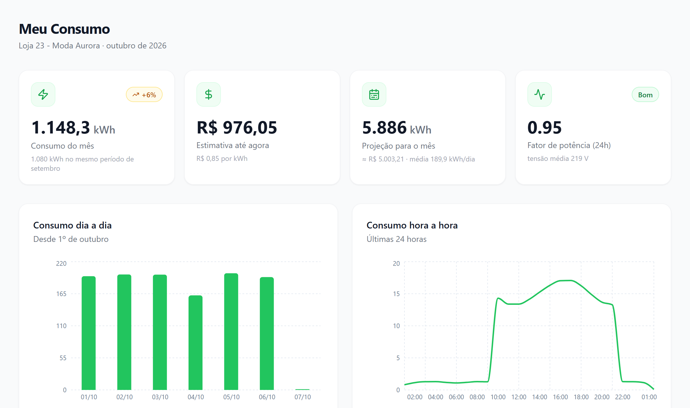
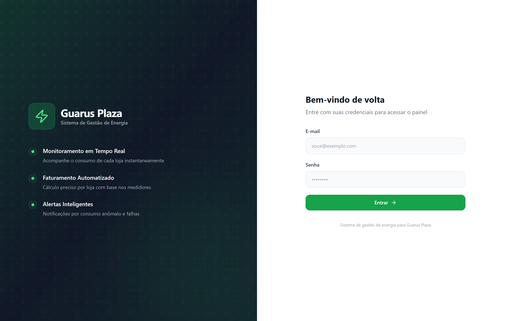
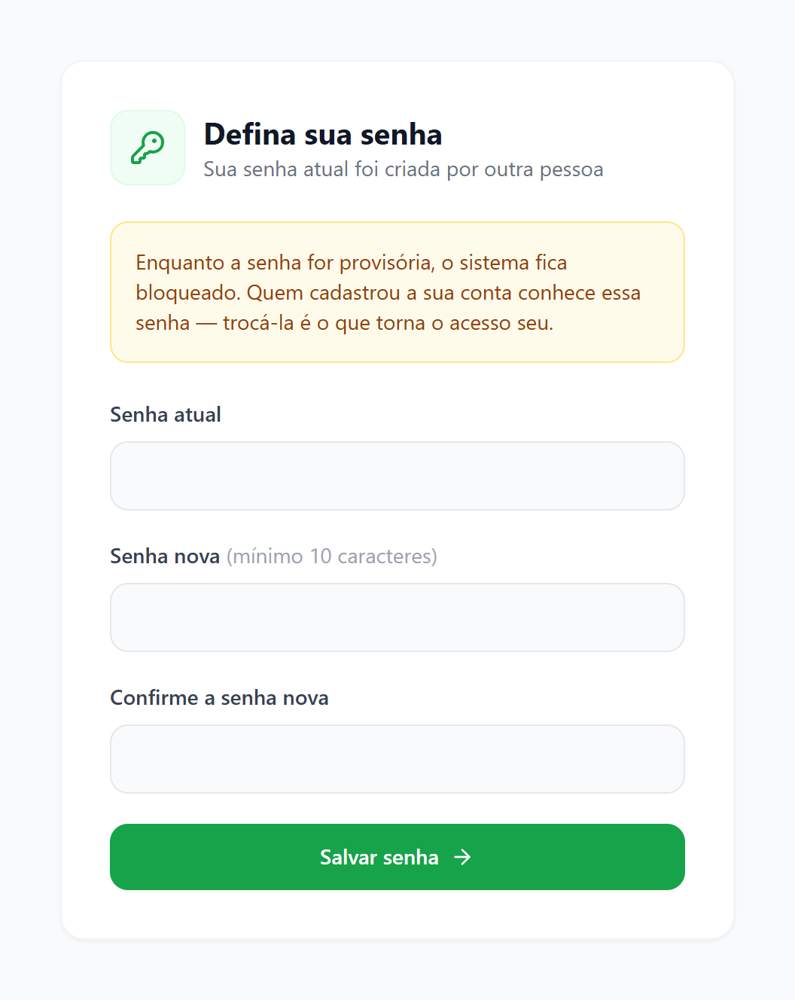
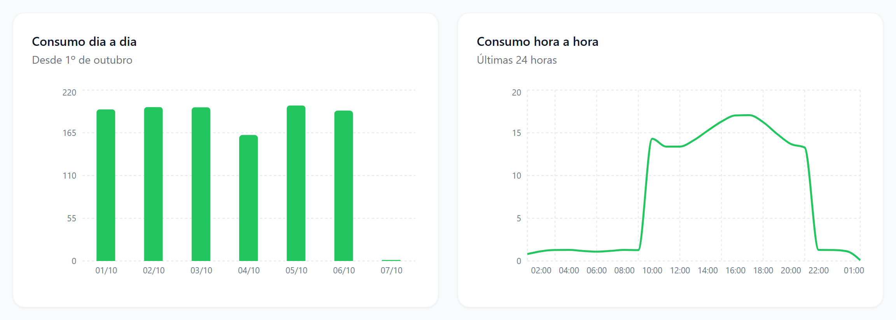
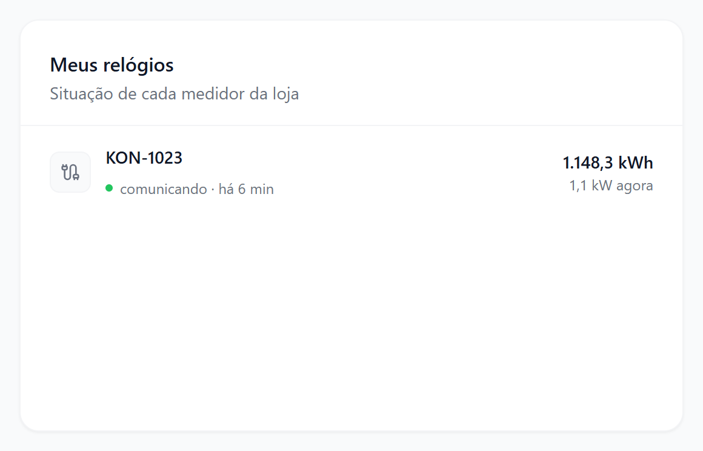
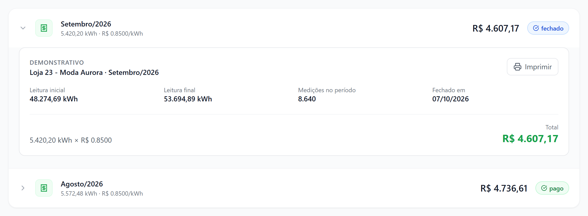
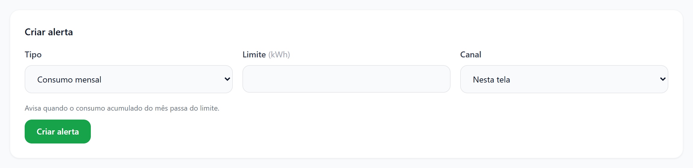
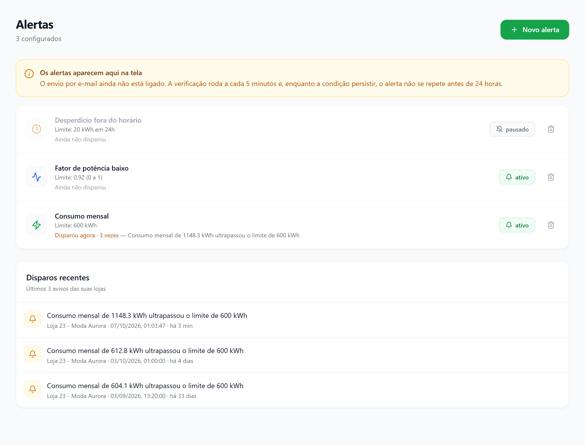

# Manual do Lojista — Guarus Plaza Energia

> Para quem acompanha o consumo de energia da própria loja. Os textos entre aspas são exatamente o que aparece na tela.
> Atualizado em 07/10/2026.

---

## 1. Antes de tudo: como o sistema funciona

O relógio de energia da sua loja é lido automaticamente a cada 30 segundos. O sistema guarda essas leituras e mostra,
no painel, quanto a loja consumiu no mês até agora. No fim do mês a administração do shopping fecha o período e a
fatura aparece em **Histórico**.

<!-- fluxo -->

| Onde | Endereço | Para quê |
|---|---|---|
| **Painel** | `https://dashboard.guarusplaza.com.br` | Consumo do mês, gráficos, relógios, faturas e alertas |

Ninguém digita leitura: o número sai direto do relógio. Por isso o painel mostra o que foi medido, não uma estimativa
por metragem ou rateio.

### Palavras que você vai ver

| Palavra | O que quer dizer |
|---|---|
| **Relógio** ou **medidor** | O aparelho que mede a energia da loja. Uma loja pode ter mais de um |
| **kWh** | A unidade de energia cobrada — a mesma da conta de luz |
| **kW** | A potência que a loja está puxando naquele instante (ar-condicionado ligado, por exemplo) |
| **Fator de potência** | De 0 a 1, mostra quanto da energia é aproveitada. Perto de 1 é bom; abaixo de 0,92 costuma indicar motor ou reator precisando de ajuste |
| **Tensão** | A voltagem que chega à loja. O padrão do shopping é 220 V |
| **Estimativa** | Consumo até agora × tarifa atual. Não é a fatura |
| **Projeção** | Quanto a loja vai consumir no mês se continuar no ritmo atual |
| **Em conferência** | O mês tem algum dado incompleto e a administração precisa conferir antes de cobrar |

---

## 2. Primeiro acesso

Quem cria o seu acesso é a **administração do shopping**. Não existe cadastro pelo próprio site.

### 2.1 Entrar pela primeira vez

1. Receba da administração o seu **usuário** (um e-mail) e a **senha provisória**.
2. Abra `https://dashboard.guarusplaza.com.br`.
3. Em "Bem-vindo de volta", preencha **E-mail** e **Senha** e clique em **Entrar**.
4. Se a senha for provisória, o sistema abre "Defina sua senha" antes de qualquer outra tela.
5. Preencha **Senha atual** (a provisória), **Senha nova** e **Confirme a senha nova**, e clique em **Salvar senha**.
6. Deve abrir a tela "Meu Consumo" com o nome da sua loja.

> Enquanto a senha for provisória, o sistema fica bloqueado. Quem cadastrou a sua conta conhece essa senha — trocá-la
> é o que torna o acesso só seu.

O que pode aparecer:

| Mensagem | O que fazer |
|---|---|
| "Credenciais inválidas" | Confira o e-mail (sem espaço no fim) e a senha, respeitando maiúsculas e minúsculas |
| "Muitas tentativas. Tente novamente em 60 segundos." | Espere o tempo indicado. Depois de 5 erros seguidos o acesso trava por 1 minuto; de 10, por 5 minutos; de 15, por 30 minutos |
| "A senha nova precisa ter no mínimo 10 caracteres." | Use pelo menos 10 caracteres. Uma frase curta é mais fácil de lembrar que uma sigla |
| "A confirmação não confere com a senha nova." | Digite a mesma senha nova nos dois campos |
| "Senha atual incorreta" | Em **Senha atual** vai a provisória que você recebeu, não a nova |
| "A senha nova precisa ser diferente da atual" | Escolha uma senha diferente da provisória |

### 2.2 Esqueci a senha

Não existe "Esqueci minha senha" na tela de entrada. Peça à administração do shopping para **redefinir a sua senha**:
você recebe uma nova senha provisória e faz de novo os passos 3 a 6 acima.

### 2.3 Trocar a senha quando quiser

1. No menu lateral, embaixo do seu e-mail, clique em **Trocar senha**.
2. Preencha **Senha atual**, **Senha nova** e **Confirme a senha nova**.
3. Clique em **Salvar senha**. Você volta para "Meu Consumo" já com a senha nova.

Para sair do sistema, clique em **Sair**, logo abaixo de **Trocar senha**.

---

## 3. Meu Consumo — a tela principal

É a primeira tela depois de entrar (**Dashboard**, no menu). O título mostra o nome da loja e o mês, por exemplo
"Loja 23 · outubro de 2026". A tela se atualiza sozinha a cada 2 minutos.

### 3.1 Os quatro números do mês

| Cartão | O que mostra | Detalhe embaixo |
|---|---|---|
| **Consumo do mês** | kWh desde o dia 1º | Quanto a loja tinha consumido no mesmo trecho do mês anterior, e a variação em % (verde = consumiu menos, âmbar = consumiu mais) |
| **Estimativa até agora** | Consumo × tarifa vigente, em R$ | A tarifa usada, em R$ por kWh |
| **Projeção para o mês** | kWh esperados até o fim do mês, no ritmo atual | O valor aproximado em R$ e a média por dia |
| **Fator de potência (24h)** | Média das últimas 24 horas | "Bom" a partir de 0,93; "Atenção" abaixo disso. Também mostra a tensão média |

> A comparação com o mês anterior é sobre o **mesmo número de dias**: no dia 10, compara os dias 1 a 10 de cada mês.
> Por isso a porcentagem não dá um salto no começo do mês.

Situações normais que confundem:

| Na tela | Por quê |
|---|---|
| "Sem tarifa" e "Tarifa ainda não cadastrada" | A administração ainda não cadastrou o valor do kWh. O consumo continua sendo medido normalmente |
| "Disponível após o primeiro dia de medição" | A projeção só aparece depois de um dia inteiro de dado. Antes disso ela erraria muito |
| "-" no fator de potência | Ainda não há leitura nas últimas 24 horas |

### 3.2 Os gráficos

- **Consumo dia a dia** — uma barra por dia, desde 1º do mês. Bom para ver qual dia da semana pesa mais.
- **Consumo hora a hora** — últimas 24 horas. Consumo alto de madrugada costuma ser equipamento esquecido ligado.
- **Tensão** — últimas 24 horas, em volts.

Passe o mouse (ou toque) numa barra para ver o número exato.

"Aguardando dados" num gráfico quer dizer que ainda não chegou leitura para aquele período — normal numa loja recém-
cadastrada.

### 3.3 Meus relógios

Mostra cada relógio da loja pelo número de série, se está comunicando e desde quando, o consumo do mês e a potência
naquele instante ("12,5 kW agora").

| Na tela | O que quer dizer | O que fazer |
|---|---|---|
| ● "comunicando · agora" | Tudo certo | Nada |
| ● "sem comunicação · há 3 h" | O relógio parou de mandar leitura há mais de 10 minutos | Avise a administração. O consumo não se perde no relógio, mas o mês pode ficar em conferência |
| "Nenhum relógio vinculado a esta loja." | A loja ainda não tem relógio associado no cadastro | Avise a administração |

### 3.4 Se você tem mais de uma loja

Aparece uma caixa de seleção no canto superior direito da tela, com o nome de cada loja. Escolha a loja e todos os
números, gráficos e relógios passam a ser dela. A mesma caixa aparece em **Histórico**.

### 3.5 O aviso "Consumo do mês ainda em conferência"

Esse aviso âmbar aparece no alto da tela quando o mês tem algum dado que impede emitir valor com segurança. O motivo
vem escrito logo abaixo:

| Motivo na tela | O que quer dizer |
|---|---|
| "nenhuma leitura no período" | Nenhum relógio da loja mandou leitura no mês |
| "lacuna de coleta de 95 min (limite 30)" | A leitura ficou parada por mais de 30 minutos seguidos em algum momento |
| "nenhuma tarifa vigente cadastrada" | Falta a tarifa — a administração resolve |

Não é cobrança errada: é o sistema se recusando a cobrar sobre um número incompleto. A administração confere antes
de fechar o mês.

---

## 4. Histórico — as suas faturas

No menu, **Histórico** abre "Minhas faturas", com uma linha por mês fechado: mês, consumo, tarifa, valor e situação.

<!-- estados -->

| Situação na tela | O que quer dizer | O que você faz |
|---|---|---|
| **fechado** | O mês foi apurado e o valor está emitido | Conferir o demonstrativo e pagar |
| **pago** | A administração registrou o pagamento | Nada |
| **em conferência** | Algum dado do mês estava incompleto; o valor aparece como R$ 0,00 até a conferência | Aguardar — a administração confere e fecha de novo |
| **aberto** | A fatura foi reaberta pela administração para ser recalculada | Aguardar o novo fechamento |

### 4.1 Ver de onde saiu o valor

1. Em **Histórico**, clique na linha do mês.
2. Abre o "Demonstrativo" com **Leitura inicial**, **Leitura final**, **Medições no período** e **Fechado em**.
3. Embaixo aparece a conta: kWh × tarifa = **Total**.

> A diferença entre a leitura final e a inicial pode não bater exatamente com o kWh cobrado: o sistema descarta
> leituras impossíveis (um salto absurdo, um relógio zerado) em vez de cobrar por elas.

Se a fatura estiver em conferência, o demonstrativo mostra "Esta fatura está em conferência" e o motivo. O sistema não
emite valor sobre um período com dado incompleto.

### 4.2 Imprimir ou guardar a fatura

- **Imprimir** (dentro do demonstrativo) abre a impressão do navegador. Para guardar em PDF, escolha "Salvar como PDF"
  como impressora.
- **Exportar CSV** (no alto da tela) baixa todas as faturas numa planilha que abre no Excel, com consumo, tarifa,
  valor, situação e leituras.

"Nenhuma fatura ainda" quer dizer que nenhum mês da sua loja foi fechado. As faturas aparecem quando o condomínio fecha
o mês.

---

## 5. Alertas — ser avisado sem ficar olhando o painel

No menu, **Alertas**. Um alerta compara o consumo da loja com um limite que você escolhe e registra um aviso quando o
limite é passado.

> **Hoje os alertas aparecem só nesta tela.** O envio por e-mail ainda não está ligado. A verificação roda a cada
> 5 minutos e, enquanto a condição continuar, o mesmo alerta não se repete antes de 24 horas.

### 5.1 Os tipos de alerta

| Tipo | Avisa quando | Limite que você digita | Exemplo |
|---|---|---|---|
| **Consumo mensal** | O consumo acumulado do mês passa do limite | kWh | 3000 |
| **Desperdício fora do horário** | Há consumo fora do horário de funcionamento nas últimas 24 h | kWh em 24 h | 20 |
| **Fator de potência baixo** | A média das últimas 24 h cai abaixo do valor | de 0 a 1 | 0,92 |
| **Tensão fora do padrão** | A tensão média das últimas 24 h se afasta de 220 V mais que o valor | volts de desvio | 15 (faixa de 205 a 235 V) |

> **Desperdício fora do horário** só funciona se a administração tiver cadastrado o horário de abertura e fechamento
> da sua loja. Sem horário, esse alerta nunca dispara. Na dúvida, pergunte à administração.

### 5.2 Criar um alerta

1. Em **Alertas**, clique em **Novo alerta**.
2. Em **Tipo**, escolha o alerta. Abaixo do formulário aparece a explicação daquele tipo.
3. Em **Limite**, digite o número (aceita vírgula: `0,92`).
4. **Canal** fica em "Nesta tela".
5. Clique em **Criar alerta**.
6. Deve aparecer "Alerta criado." e o alerta na lista, com "Ainda não disparou".

O que pode aparecer:

| Mensagem | O que fazer |
|---|---|
| "Dados inválidos" | Confira o limite: só números, sem "kWh" ou "V" |
| "Nenhuma loja vinculada ao seu cadastro" | O seu acesso ainda não tem loja. Peça à administração para vincular |

### 5.3 Acompanhar, pausar e remover

- Um alerta que já disparou mostra "Disparou há 2 h · 3 vezes — " seguido da mensagem, por exemplo "Consumo mensal de
  3120.4 kWh ultrapassou o limite de 3000 kWh" (nas mensagens de alerta o decimal sai com ponto).
- **Disparos recentes**, embaixo, lista os últimos avisos das suas lojas, com data e hora.
- O botão **ativo** / **pausado** liga e desliga o alerta sem apagar.
- A lixeira remove o alerta. O sistema pergunta "Remover este alerta?" antes.

---

## 6. Todas as mensagens

| Mensagem | Quando aparece | O que fazer |
|---|---|---|
| "Nenhuma loja vinculada ao seu acesso" | Ao entrar, em "Meu Consumo" | Peça à administração para vincular a sua loja ao seu usuário |
| "Consumo do mês ainda em conferência" | No alto de "Meu Consumo" | Ler o motivo (seção 3.5). Não precisa fazer nada |
| "Não foi possível carregar o consumo agora." | A tela não conseguiu falar com o servidor | Espere um pouco e recarregue a página |
| "Não foi possível carregar suas faturas." | Em **Histórico** | Clique em **Tentar de novo** |
| "Não foi possível carregar os alertas." | Em **Alertas** | Clique em **Tentar de novo** |
| "Aguardando dados" | Num gráfico sem leitura no período | Normal em loja nova. Se durar mais de um dia, avise a administração |
| "Sem tarifa" | No cartão de estimativa | A administração ainda não cadastrou a tarifa |
| "Esta fatura está em conferência" | No demonstrativo | Aguardar a conferência da administração |
| "Verificando sessão..." | Ao abrir o painel | Some sozinho em um ou dois segundos |

---

## 7. Problemas comuns

**"Entrei e não aparece nada da minha loja."**
1. O seu acesso ainda não tem loja vinculada ("Nenhuma loja vinculada ao seu acesso") — peça à administração.
2. Você tem mais de uma loja e está vendo outra — troque na caixa de seleção do canto superior direito.

**"O consumo parou de subir."**
1. Veja **Meus relógios**: se algum estiver "sem comunicação", avise a administração.
2. A tela se atualiza a cada 2 minutos — recarregue a página para ver na hora.

**"O consumo está muito alto."**
1. Abra **Consumo hora a hora** e veja em que horário o consumo sobe. Madrugada alta = algo ficou ligado.
2. Crie um alerta **Desperdício fora do horário** para ser avisado da próxima vez.

**"A minha fatura veio R$ 0,00."**
A fatura está **em conferência**: o mês teve dado incompleto e o sistema não emite valor sobre ele. Abra o
demonstrativo para ver o motivo. A administração confere e fecha de novo.

**"Criei um alerta e ele nunca dispara."**
1. Ele só dispara quando o limite é passado — confira se o limite não está alto demais.
2. **Desperdício fora do horário** precisa do horário da loja cadastrado pela administração.
3. Lembre: o aviso aparece só na tela de **Alertas**, não chega por e-mail.

**"Esqueci a senha."**
Peça à administração para redefinir (seção 2.2).

---

## 8. Rotina

**Toda semana:**

- [ ] Abrir **Meu Consumo** e comparar o consumo com o mês anterior
- [ ] Olhar **Consumo hora a hora** de um dia de semana: consumo de madrugada deve ser baixo
- [ ] Conferir em **Meus relógios** se todos estão "comunicando"

**Quando a fatura do mês aparecer:**

- [ ] Abrir o demonstrativo e conferir leitura inicial, leitura final e a conta
- [ ] Se estiver "em conferência", aguardar o novo fechamento
- [ ] Guardar em PDF (**Imprimir** → "Salvar como PDF")

**Uma vez, logo no começo:**

- [ ] Trocar a senha provisória
- [ ] Criar um alerta de **Consumo mensal** um pouco acima do consumo de um mês normal
- [ ] Confirmar com a administração se o horário de funcionamento da loja está cadastrado
